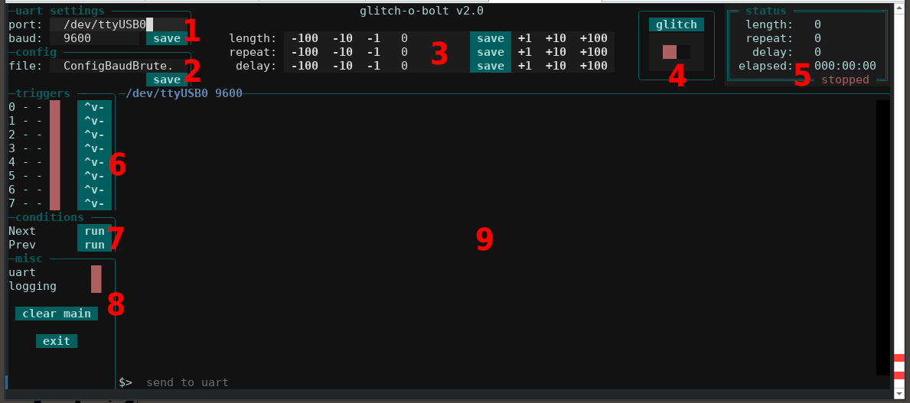

glitch-o-bolt
===============

A tool to aid with voltage glitching, specifically designed to work with the "Curious Bolt".

Written in python3, requiring "textual"



1. **UART** - Device to use and Baud rate
2. **Config** - Config file in use
3. **Glitch Settings** - Lengths and offsets to use with the bolt
4. **Glitcher** - Button to send single glitch or toggle to continuously glitch
5. **Status** - If glitch toggle is on; displays current settings and time elapsed
6. **Triggers** - Pull up / down pins and toggle enabled or disabled
7. **Conditions** - Custom toggles and buttons from the config file in use
8. **Misc** - Enabe/disable UART and logging, clear the main window, and exit the program
9. **Main Screen** - Where the UART output is displayed

---

## Running

running this is super simple:

```
$> python3 glitch-o-bolt.py
```

use the **"-c"** flag to specify a config file. eg.

```
$> python3 glitch-o-bolt.py -c ConfigBaudBrute.py
```

If no config file is specified it will automatically try to use "config.py" or create it if it doesnt exist.

---

## Configs Included

- **ConfigDemoAll** - Example to demo config file capabilities and values that can be set
- **ConfigBaudBrute** - Example to determine baud rate for UART
- **ConfigGlitchBrute** - Example to automatically find glitching lengths and offsets
- **ConfigLoginBrute** - Example to bruteforce a UART login using a dictionary attack
- **ConfigChall02** - Curious Bolt Level 1, Challenge 2 Solution
- **ConfigChall03** - Curious Bolt Level 1, Challenge 3 Solution
- **ConfigChall04** - Curious Bolt Level 1, Challenge 4 Solution